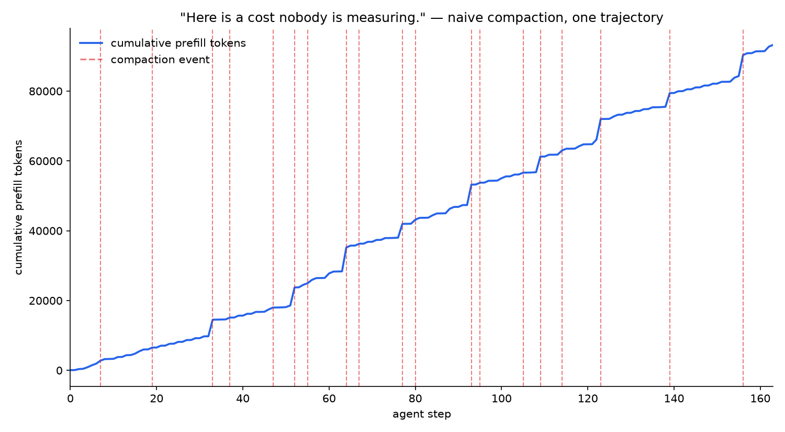
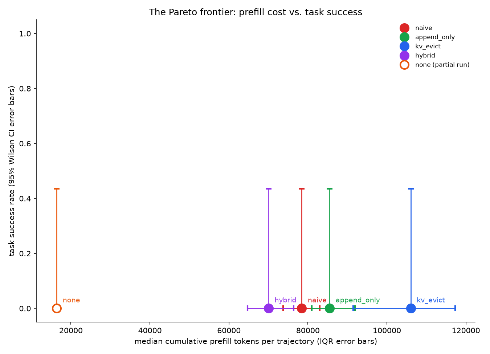

# AgentKV

Cache-aware context compaction for long-horizon LLM agents.



Naive compaction — summarize-and-replace the middle of the context whenever
it fills up — looks free. It isn't: every summarization event invalidates
vLLM's prefix cache from that point forward, forcing a full reprefill of
everything after it. The staircase above is one ~164-step agent trajectory;
each dashed line is a compaction event, and by the end this single
trajectory has reprefilled 93,276 tokens just to keep the conversation
going. Nobody measures this cost by default — it doesn't show up as an
error, a slowdown that gets profiled, or a line item anywhere. It shows up
as a bigger GPU bill.

**Routing each conversation segment by content — keep small turns verbatim,
evict large tool outputs outright, summarize the rest, always protect a
verbatim recent tail — cuts an agent's cumulative prefill cost by a median
9.8% versus naive whole-context summarization (paired Wilcoxon signed-rank
test, p = 0.0011, n = 14 trajectories), the cheapest of five measured
compaction policies on this benchmark.**



| policy | median prefill tokens/trajectory | IQR | task success (5 seeds) |
|---|---|---|---|
| **hybrid** | **70,026** | [64,753, 76,374] | 0/5 |
| naive | 78,436 | [73,727, 83,012] | 0/5 |
| append_only | 85,496 | [80,968, 91,878] | 0/5 |
| kv_evict | 106,030 | [91,427, 117,312] | 0/5 |
| none (never compacts) | 16,388 — **partial**, see limitations | [16,276, 16,596] | 0/5 |

Hybrid sits furthest left of the four complete policies — cheapest, not
just different, and every pairwise comparison against naive is a real,
paired, statistically significant result (see
`results/phase4/phase4_pareto_cost_summary.md`), not a single favorable
run. `none` (never compact, ever) is drawn as a hollow point because it
isn't a full-trajectory cost — see Limitations.

## How to reproduce

```bash
make setup       # creates .venv, installs agentkv + deps (inside WSL2 Ubuntu)
make test        # unit tests, no GPU required (~170 tests, seconds)
make demo        # live side-by-side dashboard (naive vs. hybrid), replays committed data, no GPU
make reproduce   # regenerates every figure/data file from committed trajectories
```

`make reproduce` (`experiments/run_all.py`) runs every phase's experiment
script against the trajectories already committed under `trajectories/` —
no network access at runtime, no re-recording. A full run replays every
trajectory at real scale: budget several hours of GPU time on hardware like
this project's own (an 8GB laptop GPU). `python experiments/run_all.py
--dry-run` prints the full command plan without touching the GPU;
`--smoke` runs every step at drastically reduced scale to sanity-check the
plumbing in minutes, not hours. See `results/phase6/phase6_reproduce_summary.md`
for exactly what has and hasn't been live-verified so far, and why (short
version: the command plan is verified correct; a full live `--smoke` pass
hit an unrelated WSL2/GPU environment stall this session before completing,
and a real bug it surfaced — `VLLMEngine` leaking its subprocess on a
failed boot — is fixed, but a clean end-to-end confirmation is still
outstanding).

## Limitations

Read this section before the numbers above. It's here on purpose, not as
an afterthought.

- **The Pareto plot proves a cost *ranking*, not yet a cost/quality
  *tradeoff*.** Task success is 0/5 for every single policy, naive and
  hybrid alike — a floor effect (this benchmark's 50-transaction ledger
  task is too hard for this model/scale regardless of what context it's
  given), not a policy effect. Underneath that floor, hybrid does show a
  real, measurable difference: it gets the model through ~110 of its
  ~130-call tool budget with only 0.6 ledger instructions left unprocessed
  on average, versus ~93 calls and ~9 left unprocessed for the other
  policies (`results/phase4/phase4_pareto_summary.md`) — suggestive, not a
  success-rate win, and n=5 seeds on one task configuration.
- **`none`'s Pareto point is a partial-trajectory cost.** With no
  compaction at all, every one of its 14 trajectories blew through the
  measurement model's context limit before finishing (median ~50-63 of
  ~161-169 steps) — informative on its own (no compaction can't survive
  most of a long trajectory here), but not comparable apples-to-apples to
  the other four policies' full-trajectory totals. Drawn as a hollow marker
  for exactly this reason, never averaged into the other comparisons.
- **Single configuration per policy.** One compaction threshold, one
  protected-recent-turn window, one pair of size cutoffs for hybrid's
  routing rule. Not swept — sensitivity to these constants is unmeasured.
- **Small measured models (0.6B/1.7B), extrapolated but not measured at
  scale.** The Pareto plot and every Phase 0-4 figure use
  `Qwen/Qwen3-0.6B` or `Qwen/Qwen3-1.7B` on one 8GB laptop GPU. The
  analytical cost model (`serving/cost_model.py`,
  `results/phase6/phase6_cost_model_summary.md`) projects the same
  measured token savings onto Llama-3-70B on an H100 (~10.2% FLOPs
  reduction, consistent with the 9.8% figure above) — but that projection's
  own efficiency calibration comes from batch-size-1 prefill on an
  underutilized laptop GPU, which is not necessarily the same regime as
  production H100 serving. Reported there with a fitted point estimate,
  sensitivity bounds, and an independent industry-MFU cross-check, not as a
  bare number.
- **Reproducibility is built but not yet fully live-verified end-to-end**
  — see "How to reproduce" above and `results/phase6/phase6_reproduce_summary.md`.
- **Synthetic trajectories.** All 15 recorded trajectories
  (`trajectories/`) are one synthetic on-call-incident task, recorded once
  from a single strong local model (spec §0.4) — not real production agent
  traffic.
- **Phase 5 (KV re-basing and selective recompute) was descoped, not
  attempted.** Spec itself gates it behind "only attempt after Phases 0-4
  are written up and committed" and calls it "research-grade, may fail" —
  a deliberate scope decision given the time already invested in a
  thoroughly measured Phases 0-4/6, not a negative result to report.

## Environment

- Hardware: NVIDIA RTX 4060 Laptop, 8GB VRAM, driver 572.70, CUDA 12.8.
- OS: WSL2 Ubuntu 24.04 (Windows 11 host). vLLM does not run natively on Windows;
  GPU passthrough into WSL2 confirmed working.
- Engine: vLLM 0.8.5, V1 engine, served via `vllm.entrypoints.openai.api_server`
  (not the offline `LLM.generate()` batch API — verified that it doesn't populate
  per-request `metrics`/`num_cached_tokens` in this version; see
  `src/agentkv/serving/engine.py`'s module docstring for the full rationale).
- `gpu_memory_utilization = 0.85` needed no backoff for either model — confirmed
  no OOM at `max_model_len = 8192` for both:

  | Model | KV cache capacity (tokens) | Max concurrency @ 8192 ctx |
  |---|---|---|
  | `Qwen/Qwen3-1.7B` (primary) | ~9,456 | 1.15x — tight, little headroom |
  | `Qwen/Qwen3-0.6B` (fallback) | ~29,150 | 3.56x |

  (KV capacity varies ~50-100 tokens run-to-run from free-VRAM fragmentation at
  boot; see `configs/model.yaml`'s `measured` section for the source numbers.)
- `max_model_len` is configured per model in `configs/model.yaml` (`primary: 8192`,
  `fallback: 16384`), not one shared value: Phase 2's append_only policy never
  prunes `frozen` (unlike naive, which replaces it every event), so a full
  trajectory can need more total context than naive ever does. The primary
  model's headroom is too tight (1.15x) to raise its ceiling safely, so
  Phase 2 onward runs with `--use-fallback` (`Qwen/Qwen3-0.6B`, 3.56x
  headroom) instead — spec §8's documented mitigation for "8GB is too tight
  for a useful context length."
- Pinned versions: see `pyproject.toml`. Installed and verified: torch 2.6.0+cu124,
  vLLM 0.8.5, Python 3.12.3.

## Demo artifacts

- `make demo` (`viz/dashboard.py`) — a live terminal side-by-side replay of
  naive vs. hybrid on one trajectory: a context-map strip (green = cache
  hit, red = invalidated this step), live prefill/TTFT/wall-clock/$
  counters, and a running action-agreement readout. Replays already-
  committed data — no GPU needed to run it.
- `results/demo_deck/` — the three-figure interview deck (the cliff, the
  fix, the Pareto frontier) plus `rehearsal.md`'s 60-second and 5-minute
  scripts. `python experiments/demo_deck.py` regenerates the first two
  figures from committed data; no GPU needed.

## Repository layout

See `AGENTKV_SPEC.md` §4 for the full annotated layout. Results are
organized per-phase under `results/phaseN/`; each phase's own
`phaseN_summary.md` (or `phaseN_<subphase>_summary.md`) has the full
detail, debugging history, and honest caveats behind the headline numbers
on this page.

See `AGENTKV_SPEC.md` for the full project spec and phased plan.
